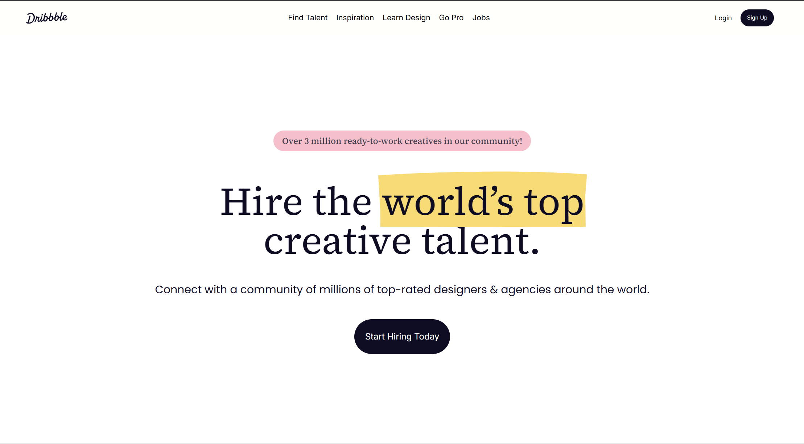

# Dribbble Landing Page (Concept)

A sleek, modern, and conversion-optimized landing page concept for [Dribbble](https://dribbble.com/). This is a fictional redesign where I imagined what Dribbble’s homepage could look like if it had a more focused landing experience to attract clients looking to hire top creative talent.

🔗 **Live Link:** [Dribbble-Landing](https://dribbble-landing.vercel.app/)



## 🌟 Features

- ✨ Eye-catching design with bold typography
- 🌍 Emphasis on global creative community
- 🎨 Clean, minimalistic layout with vibrant illustrations
- 📱 Responsive design

## 🚀 Inspiration

Dribbble is home to millions of designers, but it lacks a dedicated marketing-style landing page that speaks directly to companies looking to hire talent. This project is my creative take on what that might look like.

## 🛠 Tech Stack

- **NextJS**
- **TailwindCSS**

## 💻 Installation

1.  Clone the repository:

    ```bash
    git clone https://github.com/AdvaySanketi/dribbble-landing.git
    cd dribbble-landing
    ```

2.  Install dependencies:

    ```bash
    npm install
    ```

3.  Run the development server:
    ```bash
    npm run dev
    ```

## 📣 Feedback Welcome!

This project was built for fun and creative exploration. I’d love to hear your thoughts — feel free to open issues or reach out with suggestions or improvements!

## 📝 License

Distributed under the MIT License. See [LICENSE](LICENSE) for more information.

<br>
<b><center>Made with ❤️ by Advay Sanketi</center></b>
